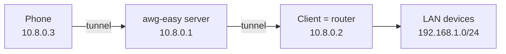

This guide shows how to reach devices in a network that sits **behind one of your clients** — for example when a client is a home/office router — directly by their addresses, from the server and from other clients.



## How it works

Two fields on the client page control this:

- **Server Allowed IPs** — the server adds these subnets to the client's `[Peer] AllowedIPs`: it accepts packets _from_ those addresses and routes packets _to_ them into that client's tunnel. A kernel route is installed automatically when you save.
- **Allowed IPs** (client side) — what the client itself routes into the tunnel and accepts from the server.

/// note | No NAT needed

The design is routed (no NAT): every peer keeps its own address, and the LAN devices talk to the tunnel addresses directly. This is the opposite direction of the [routed setup](../examples/tutorials/routed.md) guide, where the _server's_ clients live in a routed subnet.
///

## Configuration

Using `192.168.1.0/24` as the LAN behind the router client:

1. Open the client (the router) in the UI.
2. **Server Allowed IPs** → add `192.168.1.0/24`. Single addresses like `192.168.1.50` also work. Default routes (`0.0.0.0/0`, `::/0`) are rejected on purpose.
3. **Allowed IPs** → set `10.8.0.0/24, 192.168.1.0/24` (the WireGuard subnet + the LAN).
4. Save, then **re-download the client configuration** and install it on the router.
5. On the router, enable forwarding between its WireGuard interface and the LAN, and allow it in the firewall. For OpenWrt-like systems:

    ```shell
    sysctl -w net.ipv4.ip_forward=1

    # fw4/nftables example — adapt zone names to your setup
    nft add rule inet fw4 forward iifname 'wg0' oifname 'br-lan' accept
    nft add rule inet fw4 forward iifname 'br-lan' oifname 'wg0' accept
    ```

/// warning | Do not keep 0.0.0.0/0 on the router client

The default `Allowed IPs` value for new clients is `0.0.0.0/0`. On a **router** that makes `wg-quick` steal the default route: the whole LAN's internet traffic would be pushed through the VPN server, and since the server does not forward to the internet, the LAN would lose connectivity. Use the split tunnel (`10.8.0.0/24, 192.168.1.0/24`) shown above.
///

## Return path

Devices in the LAN answer automatically if the router is their default gateway (the usual case): the router already knows the WireGuard subnet through its tunnel.

If the LAN gateway is a _different_ device, either add a static route on that gateway (`10.8.0.0/24` via the router client) or masquerade the tunnel traffic on the router client:

```shell
iptables -t nat -A POSTROUTING -s 10.8.0.0/24 -o br-lan -j MASQUERADE
```

## Reaching the LAN from other clients

Clients with the default **Allowed IPs** (`0.0.0.0/0`) already route everything — including `192.168.1.0/24` — through the tunnel, so they work without changes.

Split-tunnel clients need the LAN subnet added to their **Allowed IPs** explicitly (same field, e.g. `10.8.0.0/24, 192.168.1.0/24`).

## Checklist

- The LAN subnet must **not overlap** with the WireGuard subnet (default `10.8.0.0/24`) or with the subnets of other site-to-site clients.
- IPv6 works the same way: put e.g. `fd00:1:2::/64` into both fields.
- Verify on the server:

    ```shell
    ip route show | grep 192.168.1        # 192.168.1.0/24 dev wg0
    wg show wg0 allowed-ips               # the subnet in the client's peer entry
    ping 192.168.1.50                     # reaches the device through the router
    ```

- Routes are (re)installed automatically on save and on every container/interface start — no manual `ip route` needed.
